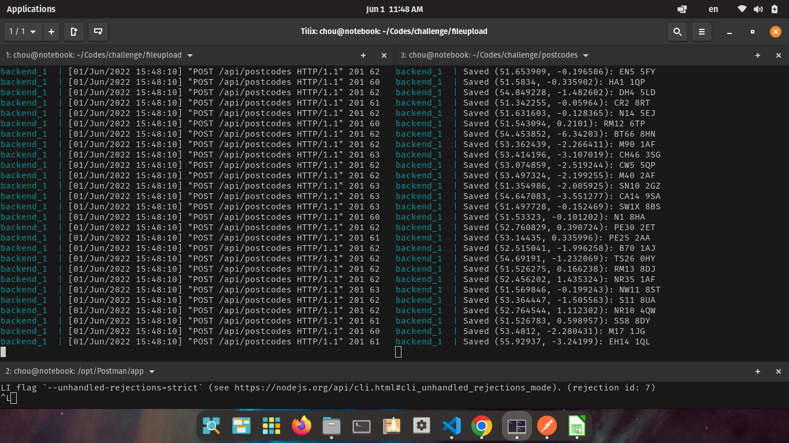

# Challenge mi Aguila

## Se implementa la siguiente arquitectura de microservicios para resolver el challenge


### Prerequisitos

```
docker
docker-compose
```

### Instalación y configuración

```
git clone https://github.com/choucoder/challenge.git
cd challenge
```

#### Servicio 1

```
cd fileupload
sudo docker-compose up
ctrl + c
sudo docker-compose up
```

##### En otra terminal realizar migraciones para tablas de MYSQL

```
sudo docker-compose exec backend sh
python manage.py migrate
```

#### Servicio 2

```
cd postcodes
sudo docker-compose up
```

### Ejecutar pruebas

#### Servicio 1 (debe estar corriendo el servicio)

```
cd fileupload
sudo docker-compose exec backend sh
python manage.py test apps
```

#### Servicio 2 (debe estar corriendo el servicio)

```
sudo docker-compose exec backend sh
pytest test.py
```

### Prueba en postman


### Ejemplo de ejecucion de servicios


