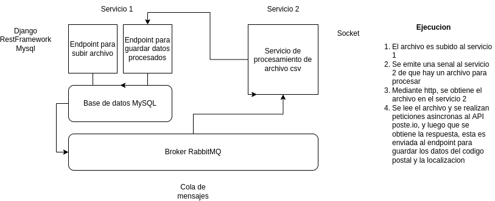
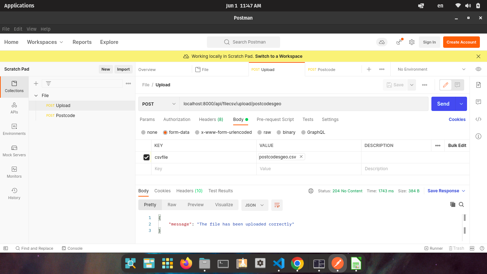

# Challenge mi Aguila

## Se implementa la siguiente arquitectura de microservicios para resolver el challenge



El servicio 2, se utilizo una arquitectura factory para el despliegue de Threds trabajadores que aceleran el proceso de consulta a la api poste y el envio de esta data hacia el endpoint del servicio 1. Se utilizo la combinacion de multithreading + asyncio para lograr una mayor velocidad de procesamiento de los archivos, esta fue escogida por el desempeno que tiene a la hora de realizar tareas de IO. Cada Thread en paralelo tarda 6 segundos en procesar 250 peticiones (obtencion del codigo postal + guardado de la data), lo que para un total de 1000 datos, el proceso tarda entre 6-7 segundos.

### Prerequisitos

```
docker
docker-compose
```

### Instalación y configuración

```
git clone https://github.com/choucoder/challenge.git
cd challenge
```

#### Servicio 1

```
cd fileupload
sudo docker-compose up
ctrl + c
sudo docker-compose up
```

##### En otra terminal realizar migraciones para tablas de MYSQL

```
sudo docker-compose exec backend sh
python manage.py migrate
```

#### Servicio 2

```
cd postcodes
sudo docker-compose up
```

### Ejecutar pruebas

#### Servicio 1 (debe estar corriendo el servicio)

```
cd fileupload
sudo docker-compose exec backend sh
python manage.py test apps
```

#### Servicio 2 (debe estar corriendo el servicio)

```
sudo docker-compose exec backend sh
pytest test.py
```

### Prueba en postman



### Ejemplo de ejecucion de servicios


